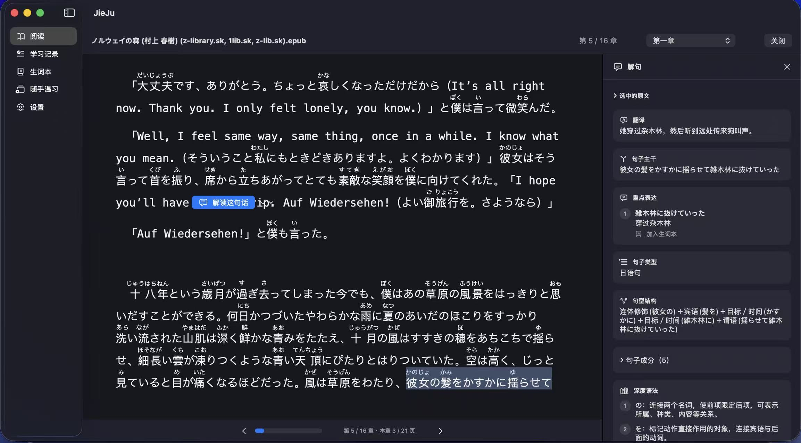
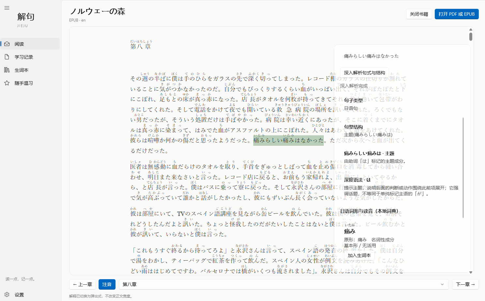

# JieJu

<p align="center">
  
</p>

<p align="center">
  Understand a sentence in context—and keep a little of the language with you.
</p>

<p align="center">
  English · <a href="README.md">简体中文</a>
</p>

<p align="center">
  <a href="LICENSE"></a>
  
  
  
</p>

JieJu is a local-first PDF and EPUB reader designed for language learning. Select a word, expression, or sentence while reading to see a translation, sentence structure, grammar notes, and key phrases. Save only what matters, then meet it again later in your vocabulary book.

> Language learning is a slow, lifelong encounter. Remember a little, forget a little—you are still moving forward.

<p align="center">
  
  <br>
  <sub>macOS · EPUB reading, Japanese furigana, and layered explanations</sub>
</p>

<p align="center">
  
  <br>
  <sub>Windows · EPUB reading, furigana, and popover syntax analysis</sub>
</p>

The project is currently at **0.1 Alpha**. The macOS app provides the most complete reading and learning loop; Windows is available as a runnable development preview. Signed installers are not available yet, so please build from source.

## Why JieJu

Many reading workflows scatter translation, dictionaries, grammar, and notes across separate tools. JieJu brings them back into the act of reading: explanations stay connected to the sentence in front of you, saved knowledge keeps its original context, and review remains quiet, optional, and pressure-free.

- **Reading first:** show explanations in a persistent sidebar or a popover without leaving the text.
- **Layered understanding:** begin with translation and sentence core, then expand structure, components, grammar, and phrases when needed.
- **Local first:** use Ollama by default; OpenAI-compatible cloud services are entirely optional.
- **Respect for forgetting:** no streaks, red badges, backlog counters, or forced reminders.
- **Honest uncertainty:** structured output is validated before saving, but small-model explanations remain learning aids rather than authority.

## Highlights

| Capability | macOS | Windows preview |
| --- | :---: | :---: |
| PDF reading | ✅ | ◐ |
| Reflowable EPUB reading | ✅ Paginated | ✅ Paginated |
| Word / expression / sentence selection | ✅ | ✅ |
| Streaming translation and layered grammar | ✅ | ✅ |
| Japanese morphology and furigana | ✅ | ✅ |
| Vocabulary sources and return to context | ✅ | ✅ |
| Optional spaced review | ✅ | ✅ |
| Ollama / OpenAI-compatible providers | ✅ | ✅ |

`✅` means the capability is present in the current source tree; `◐` means it is usable but incomplete. See [TODO.md](TODO.md) and [CHANGELOG.md](CHANGELOG.md) for the precise status.

### Read and understand

- Open text-based PDFs and reflowable EPUBs.
- Adjust EPUB theme, font size, line spacing, margins, table of contents, keyboard pagination, and reading-position restoration.
- Distinguish words, expressions, sentences, and paragraphs, with a manual choice when intent is ambiguous.
- Stream translation, sentence core, grammar points, and key phrases; request deeper syntax only when useful.
- Optionally display furigana over Japanese kanji without including readings in text selection or AI requests.

### Keep and revisit

- Save sentence explanations, vocabulary, multiple contextual meanings, and source locations.
- Return to the original passage from a learning record, vocabulary source, or review card.
- Use gentle spaced-review sessions that can be stopped at any time.
- Keep reading progress, learning data, and preferences on the device by default.

## Quick start

### macOS

Requirements: macOS 14+, Xcode 16+, and [Ollama](https://ollama.com/) for local AI. Apple Silicon (M1 or newer) is recommended.

```bash
git clone https://github.com/zhouyeyu/JieJu.git
cd JieJu
./scripts/build-macos.sh
```

The app is written to `artifacts/macos/JieJu.app`. Run `./scripts/package-macos.sh 0.1.0-alpha`
to create a ZIP and SHA-256 file. You can still open `JieJu.xcodeproj` and run the `JieJu` scheme in Xcode.
For local explanations, install the default model with `ollama pull qwen2.5:1.5b-instruct`.

### Windows

The Windows client uses WinUI 3, .NET, and WebView2 and is currently offered as an unsigned Alpha development preview. Read the [Windows development guide](Apps/Windows/README.md), then run from PowerShell:

```powershell
.\scripts\build-windows.ps1
```

The runnable app is written to `artifacts\windows\win-x64\JieJu\JieJu.Windows.exe`. Run
`.\scripts\package-windows.ps1 -Version 0.1.0-alpha` to create a ZIP with current-user install/uninstall scripts,
third-party notices, and a SHA-256 file. See the
[build and packaging guide](Docs/BUILDING.md) for all options, cached/offline restores, and signing boundaries.

## AI providers and privacy

JieJu uses Ollama at `http://127.0.0.1:11434` by default. In this mode, selected text and limited context are sent only to the configured Ollama service. If you explicitly switch to an OpenAI-compatible provider, the same content is sent to the service URL you configure, under that provider's data policy.

- The project contains no advertising, product analytics, or third-party telemetry SDKs.
- Cloud API keys are stored in macOS Keychain or Windows Credential Manager.
- API keys are never written to learning data, preferences, logs, or Git.
- EPUB files are treated as untrusted input; embedded scripts and implicit external network access are restricted.

See [PRIVACY.md](PRIVACY.md) for local storage and deletion details. Report security issues privately according to [SECURITY.md](SECURITY.md).

## Architecture

```text
macOS · SwiftUI / PDFKit / WKWebView ─┐
                                      ├─ Shared/Contracts ─ AI / Learning Data
Windows · WinUI 3 / WebView2 ─────────┘          │
                                         Shared/ReaderWeb
```

- `JieJu/`: macOS application, readers, and platform adapters.
- `Apps/Windows/`: Windows native application, domain layer, and tests.
- `Packages/JieJuLanguage/`: standalone Swift language engine, providers, CLI, and evaluation tooling.
- `Shared/Contracts/`: versioned cross-platform JSON contracts.
- `Shared/ReaderWeb/`: the EPUB bridge shared by WKWebView and WebView2.

Read [ARCHITECTURE.md](ARCHITECTURE.md) for design boundaries, [PRODUCT.md](PRODUCT.md) for product principles, and [Docs/CROSS_PLATFORM.md](Docs/CROSS_PLATFORM.md) for cross-platform conventions.

## Testing

Run the macOS and shared-module test suite with:

```bash
./scripts/test-all.sh
```

Run the Windows build, unit tests, and optional WebView2 smoke tests with:

```powershell
.\scripts\test-windows.ps1
```

Automated tests use deterministic mocks or HTTP stubs by default and do not require a live model or external network access. UI, real-Ollama, and ebook-compatibility changes should also include recorded manual verification.

The language engine can be explored independently:

```bash
cd Packages/JieJuLanguage
swift run JieJuAILab explain --stream --text "彼は本を読みながら、音楽を聞いている。"
```

## Limitations and roadmap

- Scanned PDFs do not yet support OCR.
- Complex EPUB layout, footnotes, internal links, and cross-reader stable locations are still being improved.
- Local-model latency and explanation quality depend on the device, model, and text complexity.
- Stable EPUB text anchors, footnotes, and in-book links on Windows have not yet reached macOS parity.
- The Windows Alpha package can be built and verified locally, but it is not code-signed or published as a GitHub Release yet.

The public roadmap is maintained in [TODO.md](TODO.md). Social competition, forced reminders, and streak mechanics are intentionally outside the learning experience.

## Contributing

Contributions are welcome: code, documentation, tests, language-evaluation cases, and minimal redistributable EPUB/PDF fixtures. Please read:

- [Contributing guide](CONTRIBUTING.en.md)
- [Code of Conduct](CODE_OF_CONDUCT.md)
- [Security policy](SECURITY.md)
- [Multi-agent collaboration guide](AGENTS.md)

Keep each pull request focused, and describe its verification, privacy impact, and material provenance. Contributors remain responsible for reading and validating AI-assisted work.

## License

JieJu is licensed under the [Apache License 2.0](LICENSE). Third-party components and dictionaries retain their respective licenses; release packages will include the relevant attributions.
